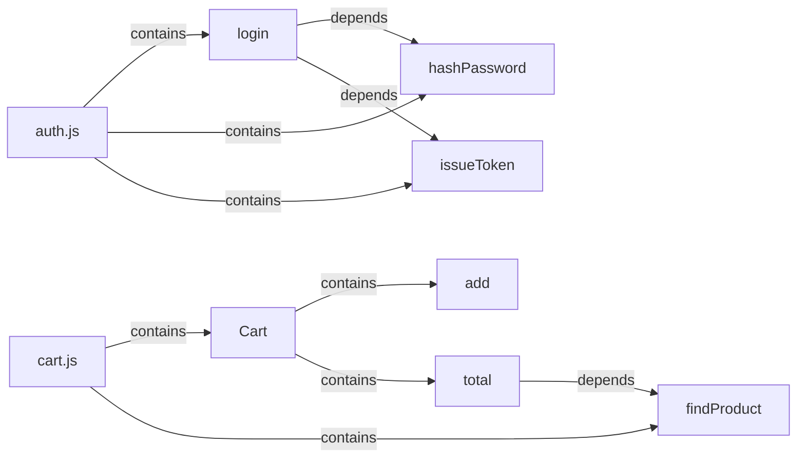

# Lucider

[](https://www.npmjs.com/package/lucider)
[](https://github.com/mehmetyz/lucider/actions/workflows/ci.yml)
[](LICENSE)
[](package.json)

**Comment directives in, compact AI context out.** Lucider walks JavaScript and TypeScript,
reads `ai-context` / `ai-body` / `ai-ignore` / `ai-deps` comments, and builds a drift-aware
graph. You keep the catalog on disk and give Claude, Codex, or any assistant a **query pack** —
not the whole tree.

npm: [lucider](https://www.npmjs.com/package/lucider) ·
Measurements: [docs/performance.md](docs/performance.md)

## Example

Source in [`examples/shop`](examples/shop) — `dumpDebugSecrets` is ignored and never enters the graph:

```js
// ai-context: Verifies password and returns a session token
// ai-body: off
// ai-deps: hashPassword, issueToken
export function login(email, password) {
  const hash = hashPassword(password);
  return issueToken(email, hash);
}

// ai-context: One-way hash of a password string
export function hashPassword(password) {
  return `sha256:${password.length}`;
}

// ai-ignore
export function dumpDebugSecrets() {
  return process.env.SECRET_KEY;
}
```

```bash
lucider examples/shop --default-body off --out-dir .lucider
lucider examples/shop --query login --depth 1
```

### Graph

`contains` is structure (file → symbol, class → method). `depends` is what you declared with `ai-deps`.



`dumpDebugSecrets` is absent. Depth-1 `--query login` is the `login → hashPassword → issueToken` cut, not the Cart side.

### Catalog markdown (`--default-body off`)

What you **store** (50 tokens vs 295 raw on this fixture, ~83% reduction). Do not paste a large unlabeled index into the model.

```markdown
# Lucider Context — examples/shop

Schema 1.0.0 · Grammar 1.1.0 · 8 symbols · 11 edges · ~83.1% token reduction (50/295).

## examples/shop/auth.js

### hashPassword — function (L10)

One-way hash of a password string

### issueToken — function (L15)

Signs a short-lived session token

### login — function (L4)

Verifies password and returns a session token
```

### Query pack (`--query login --depth 1`)

What you **give the assistant**. `login` has `ai-body: off`, so only the summary is emitted; neighbours still include bodies.

````markdown
# Lucider chunk — login

3 symbol(s) · depth 1. Ask a follow-up to expand.

## examples/shop/auth.js

### hashPassword — function (L10)

One-way hash of a password string

```js
function hashPassword(password) {
  return `sha256:${password.length}`;
}
```

### issueToken — function (L15)

Signs a short-lived session token

```js
function issueToken(subject, secret) {
  return `${subject}.${secret}`;
}
```

### login — function (L4)

Verifies password and returns a session token
````

### JSON artifact

```json
{
  "schemaVersion": "1.0.0",
  "grammarVersion": "1.1.0",
  "generatedFrom": "examples/shop",
  "metrics": {
    "rawTokens": 295,
    "emittedTokens": 50,
    "reductionRatio": 0.8305
  },
  "nodes": [
    {
      "id": "examples/shop/auth.js::login#function@0",
      "kind": "function",
      "name": "login",
      "context": "Verifies password and returns a session token",
      "contextSource": "authored",
      "bodyIncluded": false,
      "staleness": "unknown"
    }
  ],
  "edges": [
    { "type": "depends", "from": "…::login#function@0", "to": "…::hashPassword#function@0" },
    { "type": "depends", "from": "…::login#function@0", "to": "…::issueToken#function@0" },
    { "type": "depends", "from": "…::total#method@0", "to": "…::findProduct#function@0" }
  ]
}
```

## Why

- **Packs, not dumps** — `--query` returns the hit (and optional `ai-deps` neighbours). On
  isolated coding tasks, quality matched a raw 150k-token dump at ~1–5k tokens. See
  [performance](docs/performance.md).
- **Hybrid summaries** — Lucider derives a baseline from the AST; `ai-context` overrides it
  when you want a precise blurb.
- **Drift-aware** — authored comments are fingerprinted. If the code moves and the comment
  does not, the node is **stale** (`--strict` for CI).
- **Deterministic** — identical inputs → byte-identical JSON.
- **Pluggable parsers** — Tree-sitter. Ships with JS (`.js/.mjs/.cjs/.jsx`), TS
  (`.ts/.mts/.cts`), and TSX (`.tsx`).

## Install

Requires Node.js 18+. The package name on npm is [`lucider`](https://www.npmjs.com/package/lucider).

```bash
npm install -g lucider
lucider src --query login --depth 1
```

Without a global install:

```bash
npx lucider src --query login --depth 1
```

As a library:

```bash
npm install lucider
```

## CLI

```bash
lucider <path> [options]
```

| Option | Default | Description |
|--------|---------|-------------|
| `--out-dir <dir>` | — | Write `<dir>/context.json` and `<dir>/context.md`. |
| `--out <file>` | stdout | JSON artifact. |
| `--md <file>` | — | Markdown digest. |
| `--query <term>` | — | Emit a short chunk for matching symbols (not the full index). |
| `--depth <n>` | `0` | Graph hops for `--query` (`0` = hit only, `1` = hit + deps/neighbours). |
| `--default-body <on\|off>` | `on` | Body inclusion when `ai-body` is omitted. Use `off` for a catalog. |
| `--strict` | off | Exit `1` if any stale or malformed directive is present. |
| `--baseline <file>` | `.lucider/baseline.json` | Sidecar for staleness. |
| `--update-baseline` | off | Accept current fingerprints. |
| `--prefix <name>` | `ai` | Directive prefix. |

Exit codes: `0` success · `1` strict violation · `2` usage error · `3` path not found.

### Typical workflow

```bash
# Catalog on disk — do not paste this into the model for a large unlabeled tree
lucider src --out-dir .lucider --default-body off

# Pack for Claude / Codex
lucider src --query login --depth 1 --md pack.md

# Staleness baseline (commit .lucider/baseline.json)
lucider src --update-baseline

# CI
lucider src --strict
```

`--default-body on` exists so a **live query** still includes bodies on the hit slice. It is
the wrong default for “dump every symbol into chat.”

## Directives (v1.1.0)

Form: `<prefix>-<key>: <value>` in `//` or `/* */` comments immediately above a declaration.

| Key | Value | Meaning |
|-----|-------|---------|
| `ai-context` | free text | Authored summary; overrides the derived baseline. |
| `ai-body` | `on` / `off` | Include or exclude the symbol body. |
| `ai-ignore` | *(none)* | Drop the declaration from the graph. |
| `ai-deps` | comma-separated names | Explicit edges for depth-1 expansion. |

Malformed, orphaned, conflicting, unknown, and deprecated directives produce located warnings.

Grammar: [specs/001-ai-context-graph/contracts/directive-grammar.md](specs/001-ai-context-graph/contracts/directive-grammar.md) ·
JSON schema: [specs/001-ai-context-graph/contracts/artifact.schema.json](specs/001-ai-context-graph/contracts/artifact.schema.json)

## Library

```ts
import { buildArtifact, JavaScriptAdapter, serializeArtifact } from "lucider";

const artifact = buildArtifact({
  generatedFrom: "src",
  entries: [
    {
      file: "math.js",
      source: "// ai-context: adds two numbers\nfunction add(a, b) { return a + b; }",
    },
  ],
  adapter: new JavaScriptAdapter(),
  prefix: "ai",
  defaultBody: "on",
});

console.log(serializeArtifact(artifact));
```

`queryChunk(artifact, { search: "login", depth: 1 })` returns the same cut the CLI prints.

## Development

```bash
git clone https://github.com/mehmetyz/lucider.git
cd lucider
pnpm install
pnpm test
pnpm typecheck
pnpm build
```

See [CONTRIBUTING.md](CONTRIBUTING.md). Feature specs live under `specs/`.

## Releasing

Publishing is automatic from GitHub Releases (workflow [`.github/workflows/publish.yml`](.github/workflows/publish.yml)):

1. Repo secret **`NPM_TOKEN`** — npm [granular access token](https://www.npmjs.com/settings) with
   read/write to `lucider` (Automation type).
2. GitHub → **Releases → Draft a new release**.
3. Tag **`vX.Y.Z`** (for example `v0.0.2`). Create the tag on the release form or push it first.
4. Publish the release. CI already ran on the push; this job tests again, sets
   `package.json` version from the tag if needed, and runs `pnpm publish`.

`0.0.1` is already on npm as a placeholder. The next release must be a newer semver.

## License

[MIT](LICENSE) © Mehmet Yıldız
